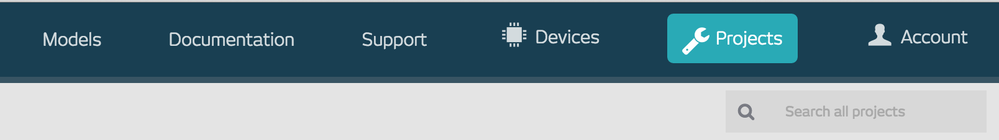
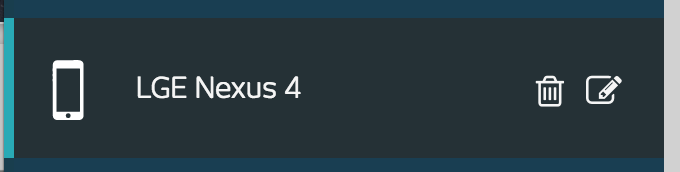

# relayr toilet demo example

Simple demo app to show how to use sensors to get information about toilet occupancy.

Hardware example uses:
magnetic switch - door open/closed
magnetometer - door locked/unlocked
presence sensor - movement

ProtoIoT example uses:
smartphone's' acceleration sensor - door open/closed

Modules
-----------------
 **hardware** - uses hardware with magnetic switch, magnetometer and presence sensor
 **protoIoT** - uses protoIoT app and phone's accelerometer sensor
 
 
 How to get the project running
-------------------------------
 
 1. clone this repository :)
 
 2. download [ProtoIoT](https://play.google.com/store/apps/details?id=io.relayr.iotsmartphone&hl=en)
 
 3. create an account on [relayr dashboard](http://bit.ly/relayrdroidcon)
   
 4. create a project on developer dashboard
     
     
 5. copy *APP ID / OAUTH CLIENT ID* & *OAUTH CLIENT SECRET* 
    to the *relayrsdk.properties* file in protoIoT module of the project
     
 4. replace DEVICE_ID constant with your ProtoIoT device id from the dashboard
    

